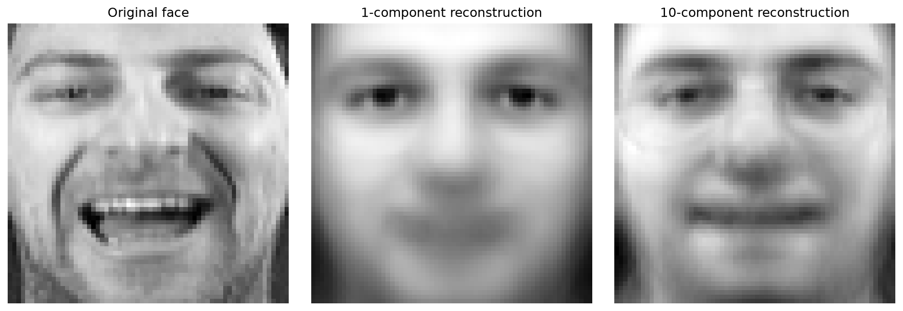
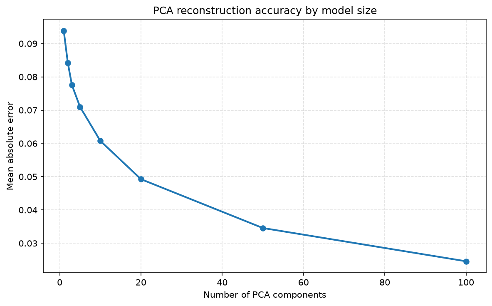

## Overview

This note documents the migration from the original Julia PCA workflow to Python for the Olivetti faces dataset.

The original project used a train/test split, a PCA projection, and a reconstruction step. The Python implementation keeps the same structure while working with `numpy` and `scikit-learn`.

## Data loading

```{python}
#| label: load-data
#| echo: true
import sys
from pathlib import Path

root = Path.cwd().resolve()
for candidate in [root, *([root.parent] if root.name != "olivetti-faces-project" else [])]:
    if (candidate / "olivetti_faces").exists():
        project_root = candidate
        break
else:
    project_root = root

venv_site = project_root / ".venv" / "lib" / f"python{sys.version_info.major}.{sys.version_info.minor}" / "site-packages"
if venv_site.exists():
    sys.path.insert(0, str(project_root))
    sys.path.insert(0, str(venv_site))

from olivetti_faces.data import load_olivetti_faces

(X_train, X_test), (y_train, y_test) = load_olivetti_faces(test_size=0.2, random_state=123)
print(X_train.shape)
print(X_test.shape)
print(y_train.shape)
print(y_test.shape)
```

## PCA fitting

```{python}
#| label: fit-pca
#| echo: true
from olivetti_faces.model import make_model

model = make_model(X_train, n_components=10)
print(model["pca"].n_components)
```

## Projection and reconstruction

```{python}
#| label: project-reconstruct
#| echo: true
from olivetti_faces.model import transform_to_pcadata, reconstruct_data

projected = transform_to_pcadata(model, X_train[:5])
reconstructed = reconstruct_data(model, projected)
print(projected.shape)
print(reconstructed.shape)
```

## Reconstruction quality

The project includes a direct comparison between the original face and the reconstructed versions using different PCA component counts.



This makes it clear that higher-dimensional PCA models recover more detail while lower-dimensional models produce a smoother approximation.

## Model accuracy comparison

We can compare reconstruction error as the number of retained components changes.



The expected pattern is that reconstruction error decreases as the model dimension increases, with a clear tradeoff between compact representation and accuracy.

## Expected behavior

- The training matrix has shape `(320, 4096)` for the 80/20 split.
- PCA projection from 4096 features to 10 dimensions should keep the same reconstruction workflow.
- Reconstructed faces should approximate the originals with small reconstruction error.
- More PCA components should reduce reconstruction error and preserve more facial detail.

## Notes

This migration intentionally excludes the generated model artifacts and the removed legacy Stat2 folder from the repository branch.

## end 
